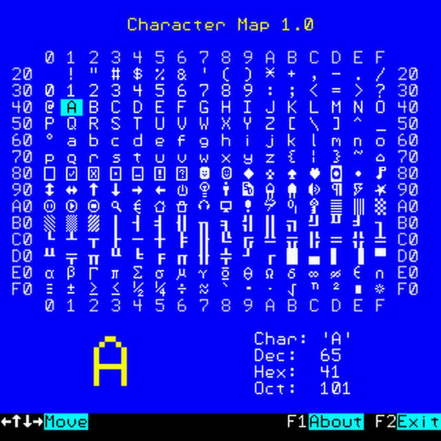
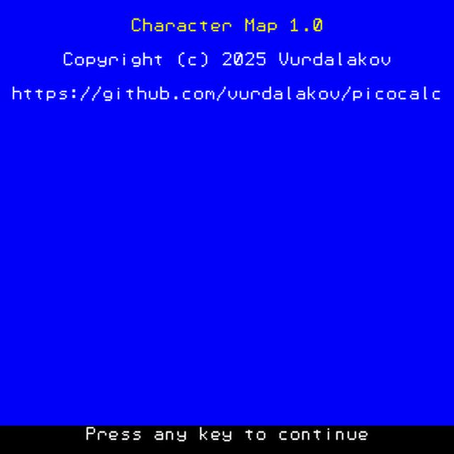

# Character Map

### Overview

The **Character Map** app is a utility that lets you explore characters and symbols from built-in font #1 (8x12).

When you select a character, the app shows its integer value in decimal, hexadecimal, and octal formats.
It also magnifies the selected character for better visibility.

### Screenshots

