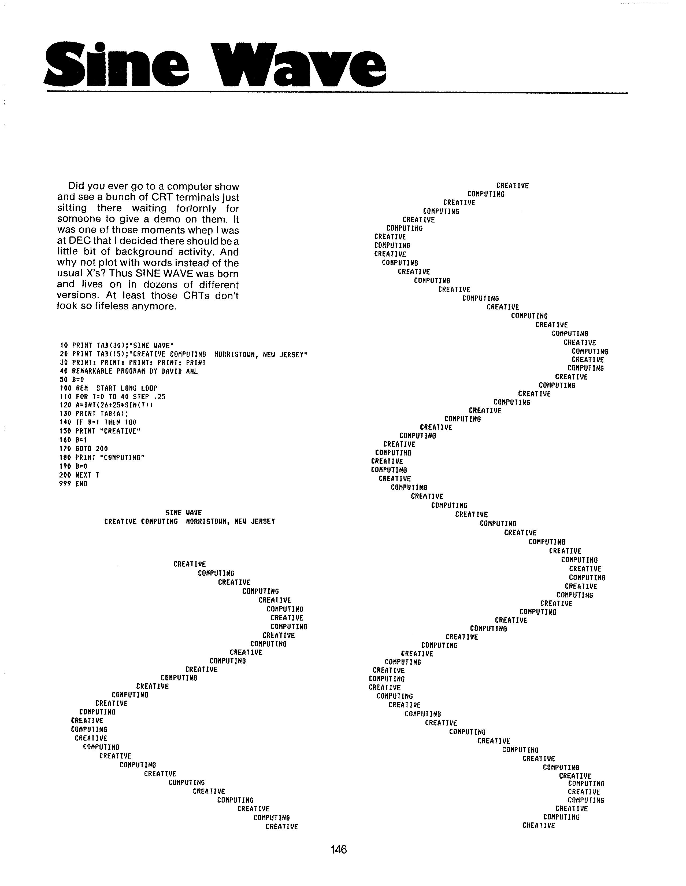

## Sinewave

This is a rewritten version of the 'Sine Wave' program from [David H. Ahl's Basic Computer Games: Microcomputer Edition](https://archive.org/details/Basic_Computer_Games_Microcomputer_Edition_1978_Creative_Computing/page/n159/mode/2up), adapted for MMBasic on the PicoCalc.

---

_BASIC Computer Games: Microcomputer Edition (Workman Publishing, 1978) ISBN 0-89480-052-3_

Did you ever go to a computer show and see a bunch of CRT terminals just sitting there waiting forlornly for someone to give a demo on them.
It was one of those moments whep I was at DEC that I decided there should be a little bit of background activity.
And why not plot with words instead of the usual X's?
Thus SINE WAVE was born and lives on in dozens of different versions.
At least those CRTs don't look so lifeless anymore.

```
10 PRINT TAB(30);"SINE WAVE"
20 PRINT TAB(15);"CREATIVE COMPUTING  MORRISTOWN, NEW JERSEY"
30 PRINT: PRINT: PRINT: PRINT: PRINT
40 REMARKABLE PROGRAM BY DAVIB AHL
50 B=0
100 REM START LONG LOOP
110 FOR T=0 TO 40 STEP .25
120 A=INT(26+25*SIN(T))
130 PRINT TAB(A);
140 IF B=1 THEN 180
150 PRINT "CREATIVE"
160 B=1
170 GOTO 200
180 PRINT "COMPUTING"
190 B=0
200 NEXT T
999 END
```


