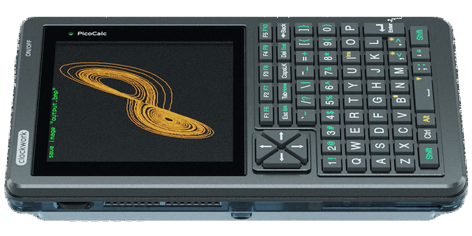

# PicoCalc projects and resources

### Links

* [Official website](https://www.clockworkpi.com/picocalc)
* [Official GitHub repository](https://github.com/clockworkpi/PicoCalc)

### Important

* Use USB-C port for serial connection.
* Use Pico Micro-USB port for firmware updates.

### Points of interest

* [Character Map](mmbasic/charmap)
